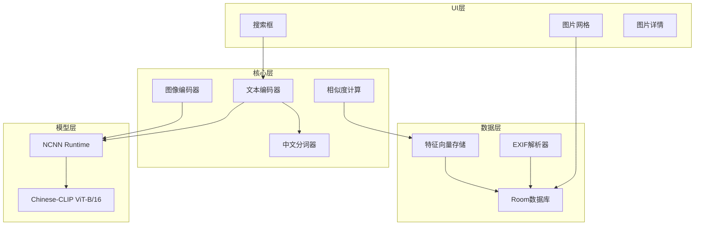
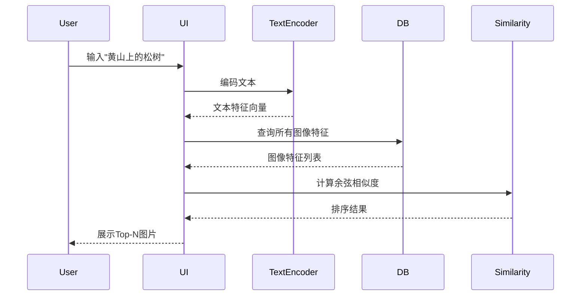

# Android中文图片检索应用开发方案

## 一、技术架构总览



## 二、Android Studio创建项目步骤

### 2.1 创建新项目

1. 打开Android Studio → `File` → `New` → `New Project`
2. 选择模板：**Empty Activity**
3. 配置：

   - Name: `PicSearch`
   - Package name: `com.example.picsearch`
   - Save location: `F:\Project\Android\picsearch`
   - Language: **Kotlin**
   - Minimum SDK: **API 26 (Android 8.0)**
   - Build configuration language: **Kotlin DSL (build.gradle.kts)**

4. 点击 `Finish`，等待Gradle同步

### 2.2 创建完成后告诉我

项目创建完成后，你应该看到以下结构：

- `app/build.gradle.kts`
- `app/src/main/java/com/example/picsearch/MainActivity.kt`
- `settings.gradle.kts`

## 三、NCNN集成（关键步骤）

### 3.1 下载NCNN预编译包

1. 访问：https://github.com/Tencent/ncnn/releases
2. 下载最新版本的 `ncnn-YYYYMMDD-android-vulkan.zip`（约50MB）
3. 解压后得到：

   - `arm64-v8a/` - 64位ARM库
   - `armeabi-v7a/` - 32位ARM库
   - `x86/` / `x86_64/` - 模拟器用

### 3.2 NCNN库位置（已完成）

你已将NCNN放置在：

```
app/src/main/jni/
├── ncnn-20250916-android-vulkan/
│   ├── arm64-v8a/
│   │   ├── include/ncnn/*.h
│   │   └── lib/libncnn.a
│   ├── armeabi-v7a/
│   │   ├── include/ncnn/*.h
│   │   └── lib/libncnn.a
│   └── x86_64/...
└── ncnn-20250916-android-vulkan.zip  # 可删除
```

还需创建：

```
app/src/main/
├── cpp/
│   ├── CMakeLists.txt
│   └── clip_jni.cpp
└── assets/
    ├── clip_visual.ncnn.param
    ├── clip_visual.ncnn.bin
    ├── clip_text.ncnn.param
    ├── clip_text.ncnn.bin
    └── vocab.txt
```

### 3.3 CMakeLists.txt配置

```cmake
cmake_minimum_required(VERSION 3.22.1)
project("picsearch")

set(NCNN_DIR ${CMAKE_SOURCE_DIR}/../jni/ncnn-20250916-android-vulkan/${ANDROID_ABI})

add_library(picsearch SHARED clip_jni.cpp)

target_include_directories(picsearch PRIVATE ${NCNN_DIR}/include)

# Vulkan支持需要链接所有相关库
target_link_libraries(picsearch
    ${NCNN_DIR}/lib/libncnn.a
    ${NCNN_DIR}/lib/libglslang.a
    ${NCNN_DIR}/lib/libSPIRV.a
    ${NCNN_DIR}/lib/libMachineIndependent.a
    ${NCNN_DIR}/lib/libGenericCodeGen.a
    ${NCNN_DIR}/lib/libOSDependent.a
    ${NCNN_DIR}/lib/libglslang-default-resource-limits.a
    android log jnigraphics vulkan)
```

## 四、模型信息（已完成）

### 4.1 当前使用模型

**Chinese-CLIP ResNet50** - 已导出并放置到assets

### 4.2 模型参数

| 编码器 | 输入层 | 输入尺寸 | 输出层 | 输出维度 |

|--------|--------|----------|--------|----------|

| 图像 | in0 | [1,3,224,224] NCHW | out0 | 1024 |

| 文本 | in0 | [1,52] | out0 | 1024 |

### 4.3 模型文件（已放置）

```
app/src/main/assets/
├── clip_vision.param
├── clip_vision.bin
├── clip_text.param
├── clip_text.bin
└── vocab.txt (21128词)
```

### 4.4 图像预处理参数

```cpp
// 均值 (RGB, 0-255范围)
mean = {122.77f, 116.75f, 104.09f}
// 归一化 (1/std/255)
norm = {0.01459f, 0.01500f, 0.01422f}
```

### 4.5 文本Tokenizer

BERT WordPiece分词：

- [CLS]: 101, [SEP]: 102, [PAD]: 0
- 最大序列长度: 52

## 五、项目结构

```
picsearch/
├── .gitignore                                # Git忽略配置
├── app/
│   ├── src/main/
│   │   ├── cpp/                              # C++/JNI代码（待创建）
│   │   │   ├── CMakeLists.txt
│   │   │   └── clip_jni.cpp
│   │   ├── jni/                              # NCNN预编译库（已放置）
│   │   │   └── ncnn-20250916-android-vulkan/
│   │   ├── java/com/example/picsearch/
│   │   │   ├── MainActivity.kt
│   │   │   ├── ui/
│   │   │   │   ├── screen/
│   │   │   │   │   ├── SearchScreen.kt
│   │   │   │   │   └── SettingsScreen.kt
│   │   │   │   ├── component/
│   │   │   │   │   └── ImageGrid.kt
│   │   │   │   └── theme/                    # 已存在
│   │   │   ├── data/
│   │   │   │   ├── db/
│   │   │   │   │   ├── AppDatabase.kt
│   │   │   │   │   ├── ImageDao.kt
│   │   │   │   │   └── ImageEntity.kt
│   │   │   │   └── repository/
│   │   │   │       └── ImageRepository.kt
│   │   │   ├── ml/
│   │   │   │   ├── NcnnClip.kt
│   │   │   │   ├── ChineseTokenizer.kt
│   │   │   │   └── FeatureExtractor.kt
│   │   │   ├── util/
│   │   │   │   └── ExifHelper.kt
│   │   │   └── worker/
│   │   │       └── IndexWorker.kt
│   │   ├── assets/                           # 模型文件（待放置）
│   │   └── res/
│   └── build.gradle.kts
├── build.gradle.kts
├── settings.gradle.kts
└── scripts/                                  # 模型转换脚本（待创建）
    └── export_chinese_clip.py
```

## 六、技术选型说明

### 6.1 不使用OpenCV

参考项目使用OpenCV存储特征向量，但我们可以避免：

- 图像加载：Android BitmapFactory
- 图像缩放：Bitmap.createScaledBitmap
- 特征存储：FloatArray

**优势**：APK体积减少10MB+

### 6.2 数据库选择Room

| 方案 | 适用规模 | 选择理由 |

|------|----------|----------|

| Room | 1-5万张 | 官方支持、稳定、与Android生态集成 |

| Faiss | 10万+ | 当前规模不需要 |

1024维 x 4字节 x 10000张 = 40MB，内存可承受

## 七、核心实现要点

### 7.1 build.gradle.kts配置

```kotlin
android {
    defaultConfig {
        ndk {
            abiFilters += listOf("arm64-v8a", "armeabi-v7a")
        }
    }
    externalNativeBuild {
        cmake {
            path = file("src/main/cpp/CMakeLists.txt")
        }
    }
}
```

### 7.2 JNI接口设计（基于参考项目）

```cpp
// clip_jni.cpp 核心结构
static ncnn::Net visual_net;
static ncnn::Net text_net;

// 图像编码
JNIEXPORT jfloatArray JNICALL encodeImage(JNIEnv *env, jobject, jobject bitmap) {
    // 1. 从Bitmap获取像素
    // 2. 转换为ncnn::Mat并预处理
    ncnn::Mat in = ncnn::Mat::from_pixels_resize(pixels, ncnn::Mat::PIXEL_RGB, w, h, 224, 224);
    in.substract_mean_normalize(mean_vals, norm_vals);
    // 3. 推理
    ncnn::Extractor ex = visual_net.create_extractor();
    ex.input("in0", in);
    ncnn::Mat out;
    ex.extract("out0", out);
    // 4. L2归一化并返回
}

// 文本编码
JNIEXPORT jfloatArray JNICALL encodeText(JNIEnv *env, jobject, jintArray tokenIds) {
    // 1. 构造输入Mat [1, 52]
    // 2. 推理
    // 3. L2归一化并返回
}
```

### 7.3 数据库设计

```kotlin
@Entity(tableName = "images")
data class ImageEntity(
    @PrimaryKey val path: String,
    val feature: ByteArray,        // 512维float向量，序列化存储
    val latitude: Double?,         // GPS纬度
    val longitude: Double?,        // GPS经度
    val locationName: String?,     // 地名（可选）
    val dateTaken: Long?,          // 拍摄时间戳
    val lastModified: Long,        // 文件修改时间
    val indexed: Boolean = false   // 是否已索引
)
```

### 7.4 检索流程



### 7.5 EXIF检索策略

- **时间检索**：解析用户输入中的时间词（"去年"、"2024年夏天"），转换为时间范围
- **位置检索**：维护一个简单的地名-坐标映射表，或使用坐标范围匹配

## 八、UI设计

### 8.1 主界面布局

```
┌─────────────────────────────┐
│  🔍 输入搜索内容...          │  <- 搜索框
├─────────────────────────────┤
│ ┌───┐ ┌───┐ ┌───┐ ┌───┐    │
│ │   │ │   │ │   │ │   │    │
│ └───┘ └───┘ └───┘ └───┘    │  <- 网格布局
│ ┌───┐ ┌───┐ ┌───┐ ┌───┐    │
│ │   │ │   │ │   │ │   │    │
│ └───┘ └───┘ └───┘ └───┘    │
│         ...                 │
├─────────────────────────────┤
│  首页    设置               │  <- 底部导航
└─────────────────────────────┘
```

### 8.2 设置界面

- 扫描图库按钮 + 进度条
- 已索引图片数量
- 清除索引选项
- 搜索结果数量设置

## 九、关键依赖

```kotlin
dependencies {
    // Jetpack Compose UI
    implementation("androidx.compose.material3:material3:1.2.0")
    
    // Room数据库
    implementation("androidx.room:room-runtime:2.6.1")
    implementation("androidx.room:room-ktx:2.6.1")
    ksp("androidx.room:room-compiler:2.6.1")
    
    // 图片加载
    implementation("io.coil-kt:coil-compose:2.5.0")
    
    // 后台任务
    implementation("androidx.work:work-runtime-ktx:2.9.0")
    
    // EXIF
    implementation("androidx.exifinterface:exifinterface:1.3.7")
    
    // 协程
    implementation("org.jetbrains.kotlinx:kotlinx-coroutines-android:1.7.3")
}
```

## 十、开发步骤

### 阶段1：项目初始化（你操作）

1. 在Android Studio中创建项目（见第二章）
2. 下载NCNN预编译包（见第三章）
3. 创建cpp目录结构

### 阶段2：配置和集成（我来写代码）

- 配置build.gradle.kts
- 编写CMakeLists.txt
- 实现JNI接口

### 阶段3：模型转换（你操作+我提供脚本）

- 我提供Python转换脚本
- 你执行转换并放入assets

### 阶段4：核心功能实现（我来写代码）

- Room数据库
- 特征提取
- 相似度计算

### 阶段5：UI开发（我来写代码）

- 搜索界面
- 图片网格
- 设置界面

## 十一、注意事项

1. **权限申请**：需要 `READ_MEDIA_IMAGES`（Android 13+）或 `READ_EXTERNAL_STORAGE`

2. **内存管理**：万张图片的特征向量约20MB（512维 x 4字节 x 10000），需要分批加载

3. **首次索引耗时**：中端机处理一张图约100-200ms，10000张约需15-30分钟，需要后台执行+进度提示

4. **模型大小**：Chinese-CLIP ViT-B/16约150MB，需考虑APK体积

## 十二、.gitignore配置

```gitignore
# Gradle
.gradle/
build/
!gradle/wrapper/gradle-wrapper.jar

# Android Studio
.idea/
*.iml
local.properties
captures/

# NCNN预编译包（体积大，不提交）
app/src/main/jni/ncnn-*/
app/src/main/jni/*.zip

# 模型文件（体积大，不提交）
app/src/main/assets/*.bin
app/src/main/assets/*.param

# 其他
*.apk
*.aab
*.hprof
*.log
.DS_Store
Thumbs.db
```

## 十三、你需要准备

1. ~~创建Android项目~~ 已完成
2. ~~下载并放置NCNN预编译包~~ 已完成
3. ~~导出Chinese-CLIP模型~~ 已完成
4. 准备测试图片集

## 十四、参考项目

- [nihui/ncnn-android-yolo11](https://github.com/nihui/ncnn-android-yolo11) - NCNN Android官方示例
- [EdVince/CLIP-ImageSearch-NCNN](https://github.com/EdVince/CLIP-ImageSearch-NCNN) - CLIP图像搜索（高度相关）

## 十五、下一步行动

**当前状态：**

- 项目已创建
- NCNN已放置
- 模型已导出并放置到assets
- 不需要OpenCV

**下一步（按顺序）：**

1. 配置.gitignore
2. 配置build.gradle.kts（添加Room、WorkManager、CMake等）
3. 创建cpp目录，编写clip_jni.cpp和CMakeLists.txt
4. 实现BERT分词器（Kotlin）
5. 实现Room数据库
6. 实现UI