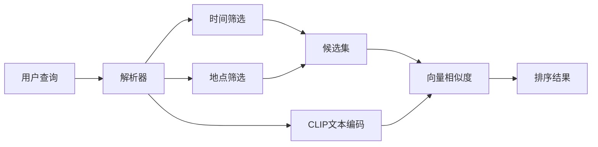

# CLIP模型精度与功能优化方案

## 一、问题1：端侧模型精度下降排查

### 1.1 已发现的可疑问题点

**问题A：模型转换使用fp16**

你使用的转换命令：

```bash
./pnnx clip_vision.pt inputshape=[1,3,224,224]f32 fp16=1
```

但JNI代码中禁用了所有fp16选项：

```299:301:app/src/main/cpp/clip_jni.cpp
    const float mean_vals[3] = {122.77f, 116.75f, 104.09f};
    const float norm_vals[3] = {0.01459f, 0.01500f, 0.01422f};
    in.substract_mean_normalize(mean_vals, norm_vals);
```
```207:216:app/src/main/cpp/clip_jni.cpp
    net.opt.use_int8_inference = false;
    net.opt.use_bf16_storage = false;
    net.opt.use_fp16_packed = false;
    net.opt.use_fp16_storage = false;
    net.opt.use_fp16_arithmetic = false;
```

**这是最可能导致精度下降的原因**：模型以fp16存储，但推理时强制使用fp32，会触发类型转换和精度不匹配。

### 1.2 排查步骤

**步骤1：验证模型输入输出名称**

检查 `clip_vision.param` 文件头部，确认输入输出层名是否为 `in0` 和 `out0`。当前代码使用：

```cpp
ex.input("in0", in);
ex.extract("out0", out);
```

**步骤2：使用fp32重新转换模型**

```bash
./pnnx clip_vision.pt inputshape=[1,3,224,224]f32 ncnnparam=clip_vision.param ncnnbin=clip_vision.bin fp16=0
./pnnx clip_text.pt inputshape=[1,52]i32 ncnnparam=clip_text.param ncnnbin=clip_text.bin fp16=0
```

**步骤3：添加调试日志对比特征向量**

在JNI层打印特征向量的前几个值，与Python端对比：

```cpp
// encodeImageNative中，l2_normalize前后打印
__android_log_print(ANDROID_LOG_DEBUG, "CLIP", "feat[0..4]: %f %f %f %f %f", 
    feat[0], feat[1], feat[2], feat[3], feat[4]);
```

**步骤4：Python端验证脚本**

```python
import torch
from PIL import Image
import cn_clip.clip as clip
from cn_clip.clip import load_from_name

model, preprocess = load_from_name("RN50", device="cpu")
image = preprocess(Image.open("test.jpg")).unsqueeze(0)
with torch.no_grad():
    feat = model.encode_image(image)
    feat = feat / feat.norm(dim=-1, keepdim=True)
print("Python feat[0..4]:", feat[0, :5].tolist())
```

### 1.3 其他潜在问题

- **双重Resize**：BitmapLoader已输出224x224，JNI又resize一次（影响较小）
- **插值方法**：NCNN默认双线性，与PyTorch可能有细微差异
- **SDPA自定义层**：需验证实现是否与PyTorch完全一致

---

## 二、问题2：EXIF元数据利用

### 2.1 当前已有

- `dateTaken`: 拍摄时间戳
- `latitude`/`longitude`: GPS坐标

### 2.2 需要增加的功能

**功能A：时间智能解析**

解析用户输入中的时间表达式，如"去年"、"2024年夏天"、"上个月"。

实现方案：基于规则的时间解析器

```kotlin
// util/TimeParser.kt
object TimeParser {
    fun parse(query: String): LongRange? {
        // 匹配"去年" -> 2025年1月1日~12月31日
        // 匹配"上个月" -> 计算范围
        // 匹配"2024年夏天" -> 6月1日~8月31日
    }
}
```

**功能B：地理位置逆编码**

将GPS坐标转换为地名（如"上海"），这是主要难点。

| 方案 | 优点 | 缺点 |

|------|------|------|

| Android Geocoder | 官方API | 需要网络、依赖Google服务 |

| 离线城市数据库 | 离线可用 | 需要额外数据文件(~5MB) |

| 预置城市坐标 | 简单轻量 | 只支持主要城市 |

**推荐方案：离线城市数据库 + 缓存**

1. 使用GeoNames的cities15000.txt（人口>15000的城市，约2.5MB）
2. 解析为SQLite数据库，按经纬度索引
3. 索引时做一次逆编码，结果缓存到ImageEntity.locationName

### 2.3 检索策略修改

当前检索只使用CLIP向量相似度。需要改为**混合检索**：



**解析流程**：

1. 提取时间词 -> 转为时间范围 -> SQL WHERE dateTaken BETWEEN
2. 提取地点词 -> 匹配城市名 -> SQL WHERE locationName LIKE
3. 剩余描述词 -> CLIP编码 -> 向量相似度排序

---

## 三、问题3：特征提取加速

### 3.1 当前性能瓶颈分析

```
图像解码(BitmapFactory) -> 预处理 -> NCNN推理 -> L2归一化
        ~30ms              ~5ms      ~50-100ms     ~1ms
```

主要瓶颈：NCNN推理（约占60%+）

### 3.2 可行的加速方案

**方案A：启用Vulkan GPU加速**

当前问题：SDPA层不支持Vulkan，导致整个vision模型无法使用GPU。

解决思路：

- 修改模型转换，避免使用SDPA算子（可能需要修改PyTorch导出代码）
- 或实现支持Vulkan的SDPA层（复杂度较高）

**方案B：使用量化模型（INT8）**

```bash
ncnnoptimize clip_vision.param clip_vision.bin clip_vision_int8.param clip_vision_int8.bin 1
```

注意：INT8量化可能进一步降低精度，需要先解决问题1后再考虑。

**方案C：流水线并行（推荐）**

不改模型，优化应用层：

```kotlin
// 使用协程实现加载-推理流水线
suspend fun indexBatch(uris: List<Uri>) = coroutineScope {
    val loadChannel = Channel<Pair<Uri, Bitmap>>(capacity = 2)
    val encodeChannel = Channel<Pair<Uri, FloatArray>>(capacity = 2)
    
    // 协程1：解码图片
    launch { for (uri in uris) loadChannel.send(uri to loadBitmap(uri)) }
    // 协程2：NCNN推理
    launch { for ((uri, bmp) in loadChannel) encodeChannel.send(uri to encode(bmp)) }
    // 协程3：存储
    launch { for ((uri, feat) in encodeChannel) save(uri, feat) }
}
```

### 3.3 其他微优化

- 图像解码使用 `inPreferredConfig = ARGB_8888` 避免RGB_565路径
- 适当增大 `inSampleSize` 减少解码后图片大小
- 考虑使用 `NDK ImageDecoder` 替代 `BitmapFactory`（API 30+）

---

## 四、实施优先级

1. **最高优先级**：使用fp32重新转换模型，验证精度
2. **高优先级**：添加时间解析功能
3. **中优先级**：添加离线逆地理编码
4. **低优先级**：特征提取加速优化（当前速度可接受）